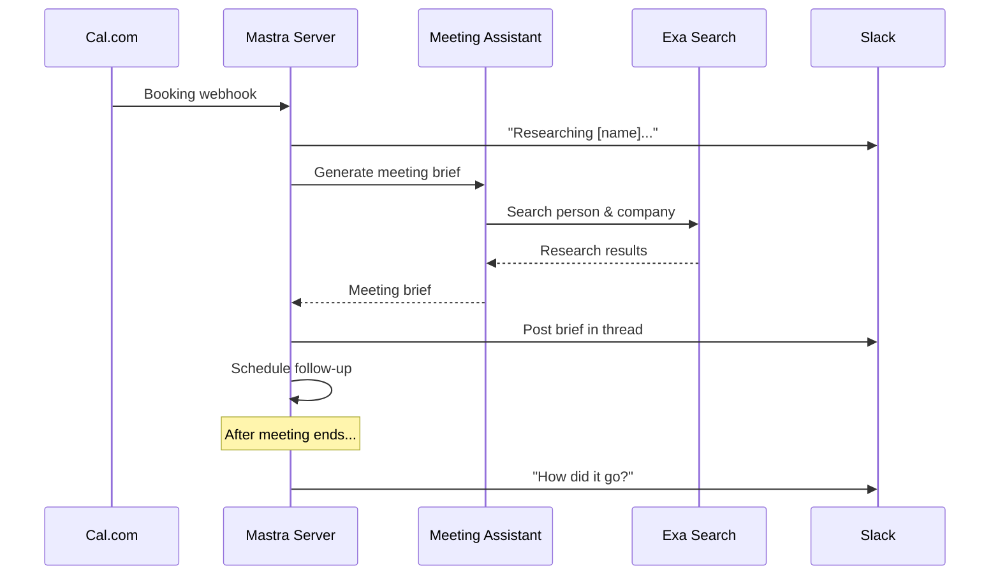
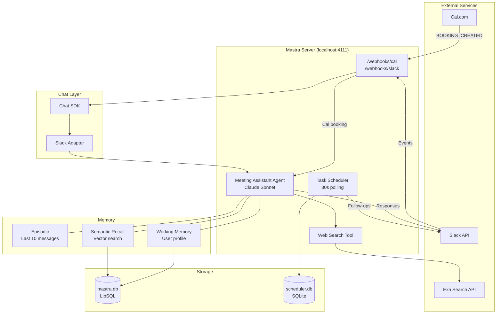
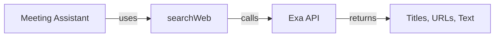
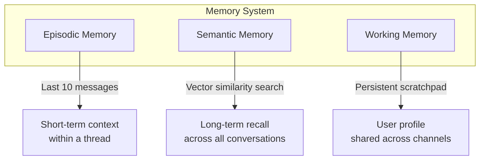
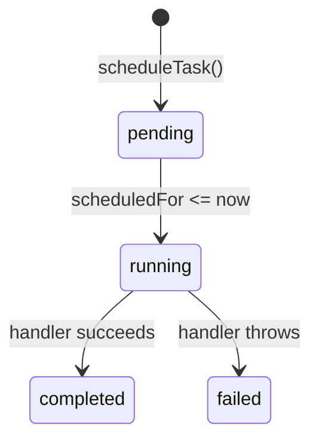

# Meeting Assistant

A personal AI assistant that preps you for every meeting — built with [Mastra](https://mastra.ai/), the TypeScript framework for AI agents.

This repo is the companion codebase for a three-part YouTube series:

1. **Build a Personal AI Assistant That Actually Works** — the foundation (agent, tools, memory, Slack + Cal.com webhooks)
2. **I Gave My AI Agent Access to My Second Brain** — Mastra Workspaces, filesystem + hybrid search over an Obsidian vault
3. **The Quality Loop Your AI Agent Is Missing** — observability + a custom LLM-as-judge scorer, all inside Mastra Studio

Need help building AI agents for your team? [Learn about my coaching and AI engineering services](https://www.damiangalarza.com/ai-agents/?utm_source=github&utm_medium=readme&utm_campaign=meeting-assistant).

## What It Does

1. Someone books a call on [Cal.com](https://refer.cal.com/dgalarza-ucac)*
2. The agent researches who they are using web search
3. A meeting brief gets posted to your Slack channel
4. You chat with the agent in-thread to ask follow-up questions
5. After the meeting ends, it reminds you to follow up
6. Over time, it learns your preferences through memory
7. When given a meeting transcript, it extracts grounded action items (with a scorer watching for hallucinations)



## Architecture



## Key Concepts

Each section maps to a concept covered in the video.

### Agent + Tools

The core agent (`src/mastra/agents/meeting-assistant.ts`) is configured with instructions, a model, tools, and memory. Tools give the agent the ability to _do things_ — in this case, search the web via the Exa API.



### Memory (Three Layers)

Mastra's memory system gives the agent context across conversations:



| Layer | What it does | Scoped to |
|-------|-------------|-----------|
| **Episodic** | Keeps the last 10 messages in context | Thread |
| **Semantic** | Vector search over all past messages — finds topics by meaning | Global |
| **Working** | Persistent user profile the agent updates over time | User (shared) |

### Webhooks

Two webhook endpoints handle external events:

- **`/webhooks/slack`** — Slack events (mentions, messages)
- **`/webhooks/cal`** — Cal.com booking creation

### Task Scheduling

A simple polling scheduler (`src/scheduler.ts`) handles time-delayed actions like post-meeting follow-ups. Tasks are stored in SQLite via Drizzle ORM and checked every 30 seconds.



### Slack Integration (Chat SDK)

The [Chat SDK](https://chat-sdk.dev/) provides a platform-agnostic interface for bot communication. The Slack adapter handles event subscriptions, threading, and typing indicators.

### Observability

`src/mastra/observability.ts` configures Mastra's built-in tracing. Every agent run, tool call, model call, memory operation, and workspace operation produces a span. Traces are visible in Mastra Studio's Observability tab.

```ts
import { Observability, DefaultExporter } from "@mastra/observability";

export const observability = new Observability({
  configs: {
    default: {
      serviceName: "mastra",
      exporters: [new DefaultExporter()],
    },
  },
});
```

The `DefaultExporter` persists traces to the same LibSQL store Mastra already uses — no extra infrastructure. If you want to ship traces to an external platform, Mastra supports [OpenTelemetry exporters](https://mastra.ai/docs/observability/tracing/exporters/otel) for anywhere that speaks OTel.

### Action Item Extraction

`src/mastra/tools/extract-action-items.ts` is a tool wired into the meeting assistant that takes a meeting transcript and returns a structured list of action items. It delegates to a focused sub-agent (`src/mastra/agents/action-item-extractor.ts`) so the extraction prompt can iterate independently from the main assistant's instructions.

A sample transcript lives at `fixtures/transcripts/coaching-call.md`.

### Custom Scorer (LLM-as-Judge)

`src/mastra/scorers/action-item-groundedness.ts` is a custom scorer that evaluates whether each extracted action item is *grounded* in the source transcript — i.e., whether a participant actually committed to the task, as opposed to the agent inferring or fabricating it.

The scorer follows Mastra's `preprocess → analyze → generateScore → generateReason` pattern:

- **preprocess** pulls the transcript (user message) and action items (parsed from the assistant's structured JSON output) from the agent run
- **analyze** asks a Claude Sonnet judge to score each item 0 or 1 and justify the call
- **generateScore** returns the mean
- **generateReason** surfaces a human-readable explanation of which items failed and why

The scorer is attached to the extractor agent with `sampling: { type: "ratio", rate: 1 }` so every run is graded. Scores show up in Mastra Studio's Scorers tab.

## Getting Started

### Prerequisites

- Node.js >= 22.13
- A Slack workspace where you can install apps
- API keys for Anthropic, Exa, and (optionally) Cal.com

### 1. Clone and install

```bash
git clone https://github.com/dgalarza/mastra-meeting-assistant.git
cd mastra-meeting-assistant
npm install
```

### 2. Set up environment variables

```bash
cp .env.example .env
```

Fill in your `.env`:

| Variable | Description | Where to get it |
|----------|-------------|-----------------|
| `ANTHROPIC_API_KEY` | Claude API key | [console.anthropic.com](https://console.anthropic.com/) |
| `SLACK_BOT_TOKEN` | Slack bot token (`xoxb-...`) | Slack app settings > OAuth |
| `SLACK_SIGNING_SECRET` | Webhook signature verification | Slack app settings > Basic Information |
| `EXA_API_KEY` | Web search API | [exa.ai](https://exa.ai/) |
| `SLACK_CHANNEL_ID` | Channel for meeting briefs | Right-click channel in Slack > Copy link |

### 3. Create the Slack app

Go to [api.slack.com/apps](https://api.slack.com/apps) and create a new app **from manifest**. Paste the contents of `slack-app-manifest.json`, then update the URLs after setting up ngrok (next step).

Install the app to your workspace and copy the **Bot Token** and **Signing Secret** into your `.env`.

### 4. Expose your local server

The Slack and Cal.com webhooks need a public URL. Use [ngrok](https://ngrok.com/) to tunnel to your local server:

```bash
ngrok http 4111
```

Copy the `https://...ngrok-free.app` URL and update:
- **Slack app settings** > Event Subscriptions > Request URL: `https://YOUR_URL/webhooks/slack`
- **Slack app settings** > Interactivity > Request URL: `https://YOUR_URL/webhooks/slack`
- **[Cal.com](https://refer.cal.com/dgalarza-ucac)*** > Settings > Developer > Webhooks: `https://YOUR_URL/webhooks/cal` (event: Booking Created)

### 5. Initialize the database

```bash
npx drizzle-kit push
```

### 6. Start the dev server

```bash
npm run dev
```

Mastra Studio is now running at [http://localhost:4111](http://localhost:4111). Mention your bot in Slack to start chatting, or create a Cal.com booking to trigger the full flow.

## Project Structure

```
src/
├── mastra/
│   ├── index.ts                       # Mastra config, webhooks, scheduler setup
│   ├── observability.ts               # Tracing config (DefaultExporter → Studio)
│   ├── agents/
│   │   ├── meeting-assistant.ts       # Main agent: memory + tools + workspace
│   │   └── action-item-extractor.ts   # Focused sub-agent for extraction
│   ├── tools/
│   │   ├── research-tools.ts          # Exa web search tool
│   │   └── extract-action-items.ts    # Extraction tool (delegates to extractor)
│   └── scorers/
│       └── action-item-groundedness.ts # LLM-as-judge scorer
├── chat.ts                            # Slack bot via Chat SDK
├── scheduler.ts                       # Polling task scheduler
└── db/
    ├── index.ts                       # Drizzle database connection
    └── schema.ts                      # scheduled_tasks table schema
fixtures/
└── transcripts/
    └── coaching-call.md               # Sample transcript for the eval demo
skills/
└── meeting-prep/                      # Workspace skill used by the main agent
```

## Scripts

| Command | Description |
|---------|-------------|
| `npm run dev` | Start Mastra dev server with hot reload |
| `npm run build` | Build for production |
| `npm start` | Start production server |

## Learn More

- [AI Agent Coaching & Engineering Services](https://www.damiangalarza.com/ai-agents/?utm_source=github&utm_medium=readme&utm_campaign=meeting-assistant)
- [Mastra Documentation](https://mastra.ai/docs/)
- [Mastra Memory](https://mastra.ai/docs/memory/overview)
- [Chat SDK](https://chat-sdk.dev/)
- [Exa API](https://docs.exa.ai/)

## Disclosure

*Some links in this README are affiliate links. If you sign up through them, I may earn a small commission at no extra cost to you. This helps support the channel. I only recommend tools I actually use.
